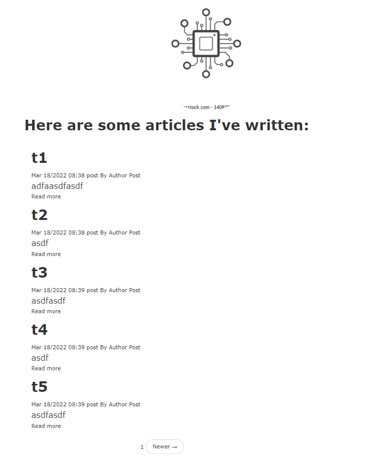

How to create blog use mongodb and php
-------------
Reading tutorial here

http://www.sitepoint.com/building-simple-blog-app-mongodb-php/
  

Update by chau  
- env. php 8.1.4, MongoDB server version: 4.2.19  
- composer install  
- config.php  
- more doc https://docs.mongodb.com/php-library/current/tutorial/crud/#find-many-documents  
- view demo in /picture-demo    

